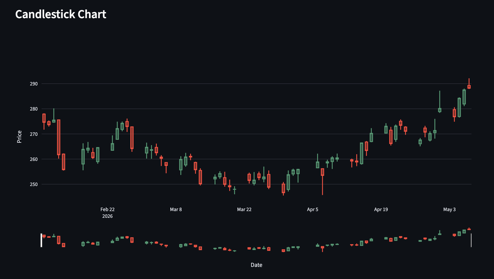

# 📈 Real-Time Stock Analytics Dashboard

An interactive financial analytics dashboard built using Streamlit, Plotly, and Yahoo Finance API to analyze real-time stock market trends, technical indicators, and comparative stock performance.

---

## 🚀 Features

- Real-time stock market tracking
- Interactive candlestick charts
- Technical indicators:
  - SMA (10 & 50)
  - RSI
  - Volatility Analysis
- Comparative stock analysis
- Trading volume visualization
- KPI metrics dashboard
- CSV export functionality
- Auto-refreshing real-time updates

---

## 🛠️ Tech Stack

- Python
- Streamlit
- Plotly
- Pandas
- yFinance API

---

## 📊 Dashboard Preview



---

## ⚙️ Installation

Clone the repository:

```bash
git clone https://github.com/mohammad-rahaman/real-time-stock-analytics.git